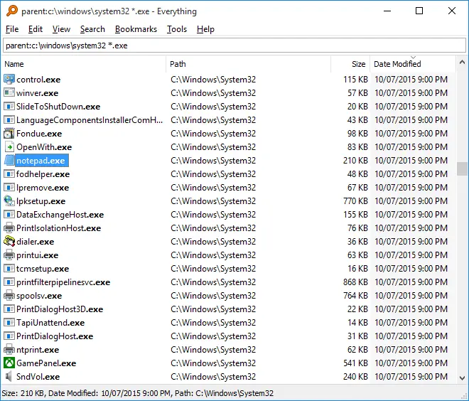

---
tags:
  - ressources/pareto
  - resources/tech
  - misc/windows
  - lang/fr
publish: "true"
---

# Ça vous est déjà arrivé...

Est-ce que ça vous est déjà arrivé de chercher un fichier ou un dossier pendant des heures dans votre ordinateur sans le trouver ? Vous savez qu'il est là, vous vous souvenez (en partie) du nom et pourtant impossible de le retrouver dans le méli-mélo de vos dossiers...

Moi si ! C'est très frustrant surtout quand on retrouve le fichier "perdu" des semaines après par hasard!

Heureusement, j'avais résolu ce problème il y a quelques années même s'il me hante encore aujourd'hui (vous comprendrez pourquoi dans la suite).

# La solution 

Pendant longtemps, j'ai pu résoudre ce problème grâce à un logiciel fantastique appelé ✨ "Everything" ✨ (Il a même [une page wikipédia](https://en.wikipedia.org/wiki/Everything_(software))).

Everything est un logiciel de recherche de fichiers pour Windows. 

Il offre une fonctionnalité toute bête, toute simple et pourtant extrêmement utile : **Il vous donne le fichier que vous recherchez peu importe où il se trouve juste à partir de son nom en moins d'une seconde.**

A l'époque (2017 ;)), la recherche sur Windows n'était pas du tout au point, lente et surtout très incomplète. Everything était juste parfait au point où j'ai oublié qu'une recherche existait nativement sur Windows. En plus, pour les aventureux, c'est possible d'utiliser la [recherche avancée](https://www.voidtools.com/en-us/support/everything/searching/#advanced_search) pour chercher par date de modification, exclure certains fichiers etc.

Toujours pas convaincu ? Une petite démo alors.

# Comment en profiter ?

Malheureusement, Everything n'est disponible que pour les systèmes Windows et pas Linux (que j'utilise actuellement).

Pour l'installer, rien de plus simple, il faut le [télécharger ici](https://www.voidtools.com/en-us/downloads/) et [suivre la procédure expliquée ici](https://www.voidtools.com/en-us/support/everything/installing_everything/).

Et voilà ! vous pouvez profiter de vos fichiers sans tracas !

# Mot de la fin

Ça doit faire 03 ans que je n'ai pas utilisé Windows comme OS personnel et par la même Everything mais si le problème dont j'ai parlé vous écho, alors vous avez peut-être la solution. Et de façon générale, si vous trouvez un fichier que vous n'auriez pas trouvé sans Everything, pensez à le renommer mieux ou à mieux le ranger dans vos répertoires pour le trouver plus facilement la prochaine fois dans un bon esprit de [Pareto](Pareto.md).

A bientôt pour un prochain article.

Merci de m'avoir lu.
