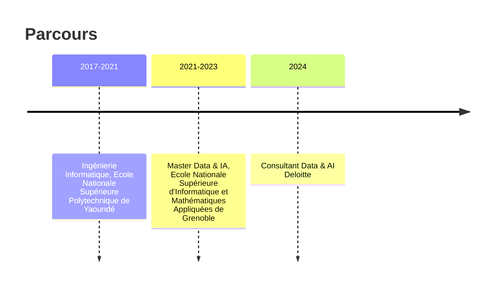

# About

Je suis N'nane, camerounais, consultant Cloud spécialisé en Data Science et Intelligence artificielle, travaillant aujourd'hui en France.

J'ai une formation en ingénierie informatique et un master en data science et IA et la chance de travailler sur des sujets de pointe. Je travaille notamment l'utilisation du Cloud pour s'approprier des solutions Machine Learning ou d'IA générative pour des entreprises de moyenne et très grande taille.

# Ce blog

Ce blog est fait pour possiblement produire du contenu utile sur les sujets de l'intelligence artificielle ( #ressources/ai), data ( #ressources/data) et du cloud ( #ressources/cloud). Il est destiné aux :

- Professionnels du Cloud
- Professionnels de l'IA
- Enthousiastes (étudiants, apprenants) tech notamment sur les domaines de l'IA et du Cloud.

Cependant, ce blog reste avant tout personnel et sujet à mes intérêts. D'autres types de contenus peuvent être produits notamment quelques uns comme :

- [Pareto](Pareto.md)
- 

J'espère que votre balade ici sera constructive (la plupart du temps).

Note: J'ai une expérience de pointe sur Google Cloud Platform donc la plupart des exemples seront pris dans ce cadre.

# Historique d'éditions

| Date       | Description                                                      |
| ---------- | ---------------------------------------------------------------- |
| 2024-09-02 | Version initiale                                                 |

